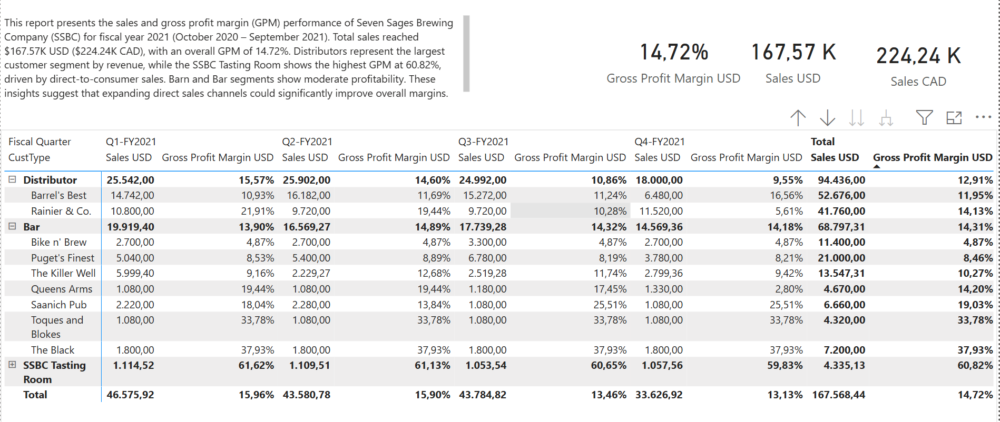
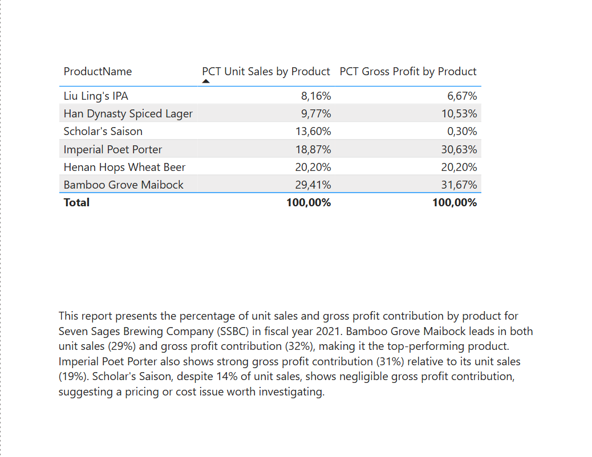
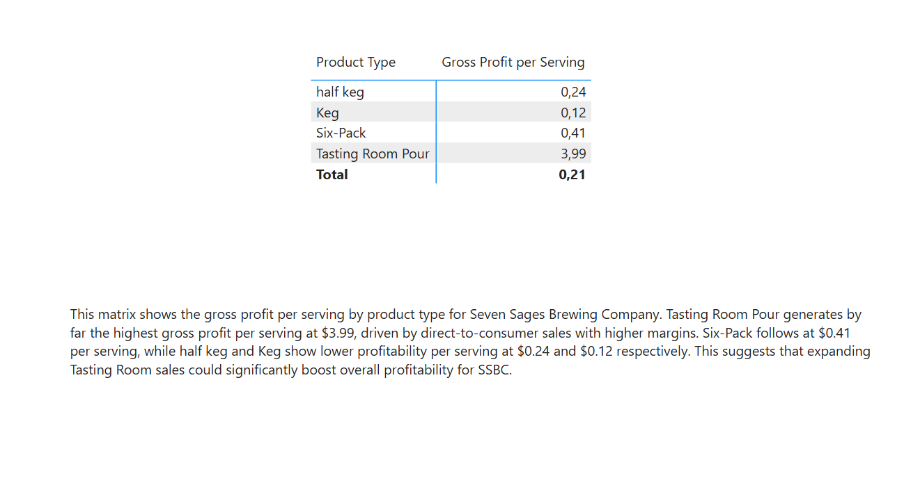
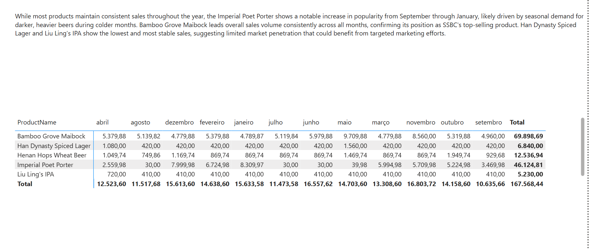

# SSBC Power BI Data Model

## Overview
Final project for Udacity's Course 2 - Data Analysis and Visualization with Microsoft Power BI.

This project builds a complete data model and Power BI report for **Seven Sages Brewing Company (SSBC)**, enabling the CFO to analyze sales performance and profitability across products and customer segments.

## Report Preview

### Sales and GPM

### Gross Profit and Unit Sales

### SO1 - Product Type

### SO2 - Seasonality

## Data Model
- **Fact Table:** Sales
- **Dimensions:** Products, Customer List, Date Table, USD-CAD Exchange Rates, CFO CostPrice

## DAX Measures
- Sales USD
- Sales CAD
- Cost of Sales USD
- Gross Profit Margin USD (%)
- Unit Sales by Product
- PCT Unit Sales by Product (%)
- PCT Gross Profit by Product (%)
- Gross Profit per Serving

## Report Pages
1. **Sales and GPM** - Cards with total sales + matrix by customer type and fiscal quarter
2. **Gross Profit and Unit Sales** - Product breakdown by unit sales and gross profit share
3. **SO1 - Product Type** - Profitability per serving by product type
4. **SO2 - Seasonality** - Sales by product and calendar month

## Key Results
- Total Sales USD: $167.57K
- Total Sales CAD: $224.24K
- Gross Profit Margin: 14.72%

## Tools
- Microsoft Power BI Desktop
- Power Query
- DAX
